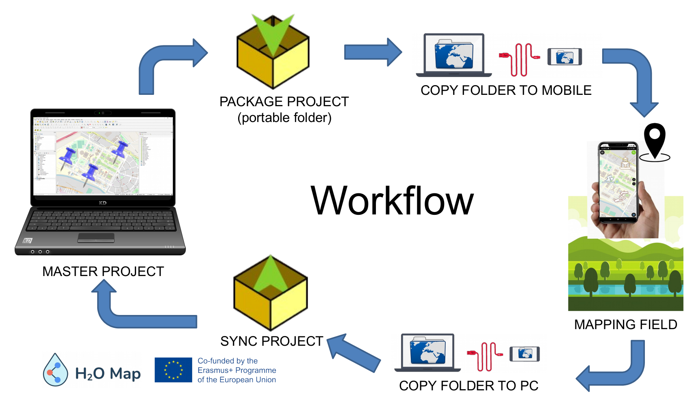
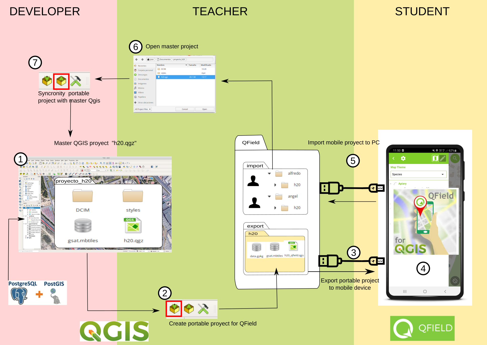

# qfield_cefire

Proyecto de Qfield-Qgis para demostración de trabajo de campo
(https://josemamira.github.io/qfield_cefire)

**Flujo de trabajo**

**Roles**

 

**Parte 1: Trabajando con especies**

- [Documentación abreviada](doc/manual_abreviado.md)
- [Documentación extendida](doc/manual.md)

**Parte 2: Explotando la información de H2OMaps**
- Visualización (https://mapache.uji.es/)
- Edición (https://mapache.uji.es/upload)

**Demo**
Demo mapping: [ver](https://github.com/josemamira/)

Autor: [José Manuel Mira Martínez](https://github.com/josemamira/qfield_cefire/demo/index.html)

