# PROPUESTA PRÁCTICA PARA INVENTARIO DE ESPECIES CON QFIELD

**OBJETIVO**:

Inventario de espécies vegetales en el campus de la UA utilizando una
aplicación para la captura de datos en campo haciendo uso del GPS

**OBJETIVO SIG**

-   Generar proyecto (en Qgis) preparado para trabajar de forma
    desconectada (offline) en el campo

    -   Formularios

    -   Fondo con raster en formato MbTiles

-   Diseño de formularios avanzados para facilitar el trabajo de campo

-   Trabajo de campo con Qfield

    -   Añadir fotografías

-   Sincronización de datos del campo con el proyecto de Qgis

**REQUERIMIENTOS**

-   Qgis

    -   Addon QField

-   Móvil

    -   Aplicación para Android **Qfield**

    -   Cable USB para transferir contenido del móvil al PC

**DOCUMENTACIÓN**:

Para el trabajo de campo:

<https://web.ua.es/es/vr-infraestructures/infraestructuras-medioambiente/documentos/publicacion-sobre-el-paisaje-de-la-universidad-de-alicante/paisaje-2.pdf>

Para Qfield:

-   Leer: <https://docs.qfield.org/es/how-to/attributes-form/>

-   Qfield website: <https://qfield.org/>

**ESPECIES PARA INVENTARIAR**

Listado obtenido del PDF

1 Palmera helecho. Cycas circinalis

2 Palmera mexicana. Washingtonia robusta

3 Ciprés común. Cupressus sempervirens

4 Olivo. Olea europaea

5 Palo borracho. Chorisia speciosa

6 Laurel de indias. Ficus microcarpa

7 Plátano de sombra. Platanus orientalis

8 Jacaranda. Jacaranda mimosifolia

9 Almez. Llidoner. Celtis australis

10 Árbol del amor. Cercis siliquastrum

11 Pie de elefante. Yucca elephantipes

12 Candelabro. Euphorbia candelabrum

13 Aloe vera. Aloe vera

14 Cuello de cisne. Agave attenuata

15 Cactus barril. Asiento de la suegra. Echinocactus grusonii

16 Drago de canarias. Dracaena draco

17 Palmito. Margalló. Chamaerops humilis

18 Falsa platanera. Strelitzia augusta

19 Kentia. Palmera rizada. Howea belmoreana

20 Encina. Carrasca. Quercus ilex

21 Buganvilla. Bougainvillea sp.

22 Eucalipto blanco. Eucalyptus globulus

23 Higuera australiana. Ficus macrophylla

24 Pino de pisos. Araucaria heterophylla

25 Quejigo. Quercus faginea

26 Morera. Morus alba

**FASES DE TRABAJO**

0\. Crea una carpeta llamada "practica_qfield" donde ubicarás todos los
datos de la práctica

1\. Generar un proyecto en Qgis

-   SRC Mercator (EPSG: 3857)

-   Añadir fondo XYZ de OpenStreetMap

-   Añadir WMS PNOA (URL: <http://www.ign.es/wms-inspire/pnoa-ma> )

-   Crear 2 grupos": FONDO, TABLAS. En FONDO pondrás las 2 capas ráster.

2\. Crear una base de datos GPKG, llamada especies, con el Browser

3\. Crear una (geo)tabla de puntos llamada "especies" (SRC: 4326) con
esta estructura:

Ejemplo captura:

-   \"fid\" INTEGER PRIMARY KEY AUTOINCREMENT NOT NULL,

-   \"geometry\" POINT → SRC: 4326

-   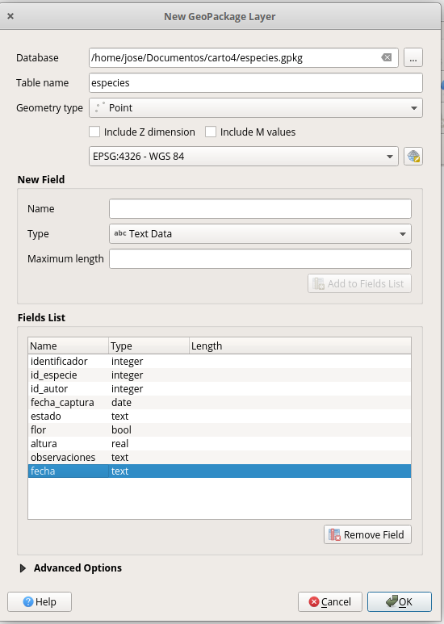

-    \"identificador\" INT LARGO,

-   \"id_especie\" INT,

-   \"id_autor\" INT,

-   \"fecha_captura\" DATE,

-   \"estado\" TEXT,

-   \"flor\" BOOLEAN,

-   \"altura\" REAL,

-   \"observaciones\" TEXT,

-   \"foto\" TEXT

-   \"incidencias\" BOOLEAN,

-   \"enfermedades\" BOOLEAN,

-   \"inc_vandalismo\" BOOLEAN,

-   \"inc_falta_riego\" BOOLEAN,

-   \"inc_falta_abono\" BOOLEAN,

-   \"enf_pulgon\" BOOLEAN,

-   \"enf_trips\" BOOLEAN,

-   \"enf_escamas\" BOOLEAN,

-   \"enf_mosquita_blanca\" BOOLEAN,

-   \"enf_gusanos_larvas\" BOOLEAN,

-   \"enf_caracoles\" BOOLEAN

4\. Añadir a la TOC la tabla con las especies: **especies.ods**

-   Renombrarla como tabla "listado_especies"

-   Subirla (arrastrar) a la base de datos GPKG

-   Eliminar del TOC el "ods"

-   Añadir la tabla "listado_especies" del GPKG al TOC (preferentemente
    en el grupo "TABLAS")

**DISEÑO**

5\. Modificar **formulario** para facilitar la toma de datos

-   Poner el diseño en modo: Diseñador de arrastrar y soltar

-   Crear 4 pestañas: **Básico, Otras, Media, Incidencias,
    Enfermedades**

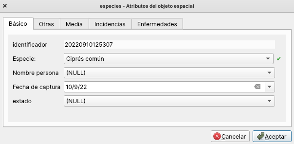

-   Arrastrar cada campo a la pestaña correspondiente. Seguir
    indicaciones de la imagen siguiente:

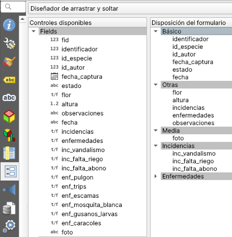{width="4.75in"
height="4.854166666666667in"}

**DISEÑO DEL FORMULARIO**
___
Identificador:

-   Widget: Edición de texto

-   Editable: NO (vacío)

-   Valor por defecto: **to_int( format_date(now(),\'yyyyMMddhhmmss\') )**

___
id_especie:

-   Widget: Relación de valores

-   Capa: listado_especies

-   Columna clave: id_especie

-   Columna de valores: nombre_comun

-   Valor predeterminado: 0

-   Restricciones:

    -   No nulo

    -   Forzar restricción no nula
___
id_autor:

-   widget: mapa de valor

-   alias: nombre persona

-   valores:

    -   1\. Maria

    -   2\. Pedro

    -   3\. Paula

    -   4\. Jose
___
fecha_captura:

-   widget: Fecha/hora

-   Formato: fecha

-   Valor por defecto: now()
___
Estado:

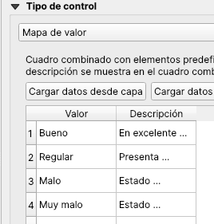
___
Flor:

-   Alias: ¿Tiene flor?

-   Widget: Casilla de verificación

-   Valor por defecto: false
___
Altura:

-   Widget: Rango → Tipo "Deslizador"

-   Rango de 1 a 30 metros, y paso de 1
___
Incidencias:

-   Alias: Incidencias observadas

-   Widget: Casilla de verificación

-   Valor por defecto: false
___
Enfermedades:

-   Alias: Incidencias observadas

-   Widget: Casilla de verificación

-   Valor por defecto: false
___
**Configuración de las pestañas siguientes:**
___
Incidencias:

-   Activar "Controlar visiblidad por expressión:

-   Expressión: \"incidencias\" = true
___
Enfermedades:

-   Activar "Controlar visiblidad por expressión:

-   Expressión: \"enfermedades\" = true
___
Configuración de "foto" para realizar fotografías y almacenar la ruta al
fichero JPG

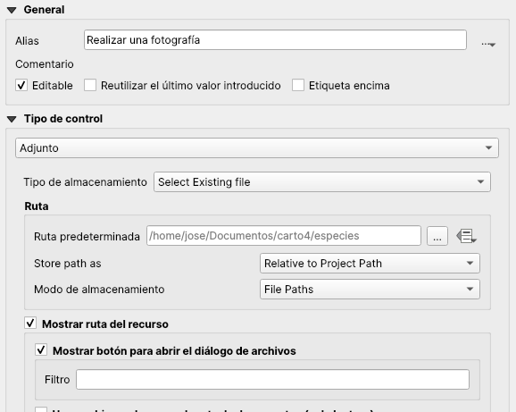

**GENERAR MBTILES**
===

6\. Generar una conjunto de tiles agrupadas en un contenedor MBTILES
procedente del WMS del PNOA ( <http://www.ign.es/wms-inspire/pnoa-ma> )

-   Comando: Generar teselas XYZ (Mbtiles)

-   Características

    -   Dibujar como extensión el campus de la UA (sin el Campus
        Científico)

    -   Niveles del 10 al 19 (aprox. 3 Mb)

    -   nombre fichero: "orto_ua.mbtiles"

-   Añade la layer Mbtiles creada a la TOC y arrástrala al grupo "FONDO"

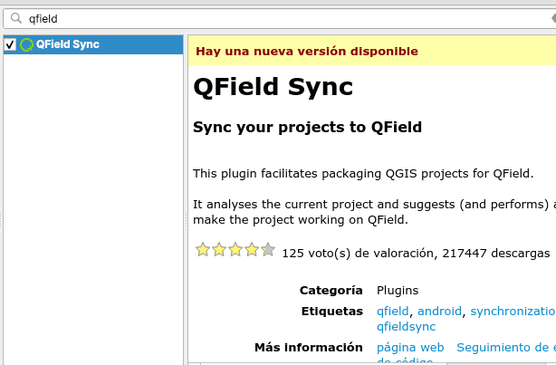

**CREAR PROYECTO PORTABLE PARA QFIELD**
===

7\. Instalar el complemento "Qfield Sync"

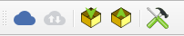

8\. Configurar el proyecto para Qfield

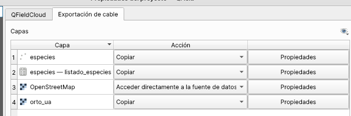

7\. Generar el proyecto "portable" (Empaquetar) para utilizar con la App
Qfield

-   Crea 2 carpetas dentro de la carpeta "practica_qfield"

    -   **exportar**: esta carpeta la utilizarás para empaquetar los
        proyectos "portables"

    -   **importar**: en esta carpeta ubicarás la carpeta del móvil que
        contendrá todo el trabajo de campo realizado con la App Qfield

-   Empaqueta el proyecto utilizando el icono correspondiente del
    complemento Qfield. Es recomendable crear dentro de "exportar" una
    carpeta con un nombre adecuado para el proyecto portable que incluya
    la fecha del trabajo de campo. Ejemplo: "empaquetado_20220910"

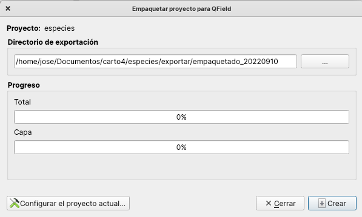

Se generarán estos archivos:

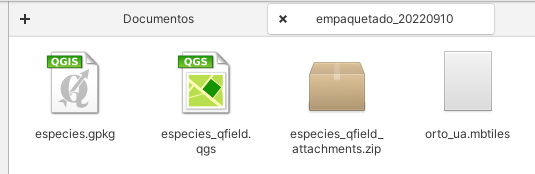

8\. Copiar desde el PC la carpeta empaquetada al móvil utilizando el
cable USB

La ruta en el móvil es la siguiente:

tu móvil → Almacenamiento interno compartido \> Android → data →
ch.opengis.qfield→ files → Imported Projects

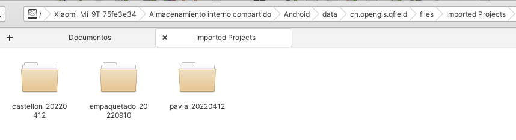

**9. Trabajar con Qfield**
===

**SINCRONIZAR**

10\. Copiar la carpeta de trabajo del móvil al PC, dentro de la carpeta
"importado"

11\. Sincronizar desde Qfield utlizando el icono correspondiente del
complemento Qfield Sync

**NOTA 1:** Tras un tiempo (ten paciencia) podrás ver como aparecen las
especies recompiladas con Qfield en el campo.

**NOTA 2:** Recuerda que si tienes que volver a salir debes de
empaquetar de nuevo el proyecto para que se incluyan los puntos que ya
tienes.

Objetivo complido. Gracias por tu atención
